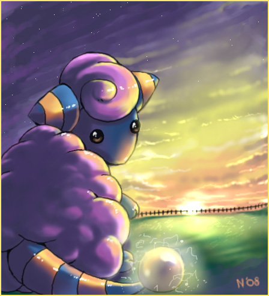

# Chat Bot

## Context

Chat Bot is a programming software to dialog with a bot

### Coded with


* HTML5
* CSS3

### Start up

* git clone
* open in the browser

### Structure

```bash
.
├── assets
│ └── img
│ └── 42-plop.jpg
├── css
│ ├── index.css
│ └── reset.css
├── index.html
└── Readme.md

```
### Assets

You can add the profile image in the img file.

## Components

* Navigation - Side bar the navigation for chat bot

* contacts - All contact connected to the chat bot (for each users)
```html
<li>
  <div class="img-user">
    
  </div>
  <span>User 1</span>
  <span class="msg">24</span>
</li>
```

* profil - User profil and informations (avatar picture and name)

```html
<div class="avatar">
  <figure></figure>
  <span class="avatar">Jilow</span>
</div>
```

* log in - log in and log out for the user

* Main part - Main part with the chat

* messages - every message with the sending date and time, name of the sender and his avatar picture
```html
<div>
  <div><span class="message me">Je veux bien 80/80</span></div>
  <div><span class="infome">25/02 </span></div>
</div>
<div>
  <div></figure>
  </div>
  <div><span class="message notme">Mais ça marche pas comme ça --"</span></div>
  <div><span class="info">Jilow</span></div>
  <div><span class="info">02/04 </span></div>
</div>
```

* send message - A simple form with an input text and an input submit
```html
<form action="#" method="POST" class="main form">
  <input class="text" type="text" placeholder="Message">
  <input class="btn" type="submit">
</form>
```

### Style
Use of a reset.css to start from scatch.
The reset is set in index.css wich is the main part of chat-bot CSS.

### Authors
[**Florian Lina**](https://github.com/Jilow42) - MDS Paris Student.

## Fonctionnality

None, it's juste a template for now.